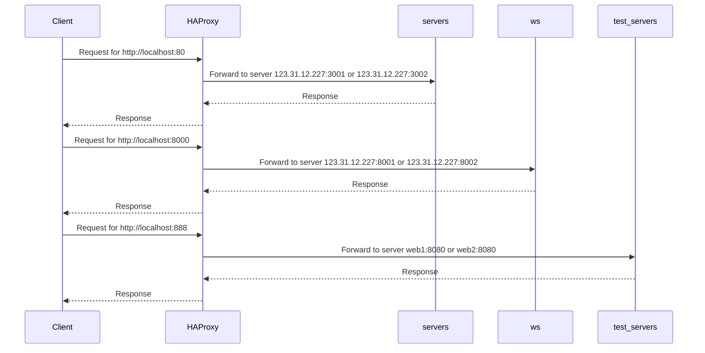

Run with `docker-compose up`: 

+ Ở port 80: HAproxy sẽ forward request đến 2 server: `123.31.12.227:3001` và `123.31.227:3002` theo thuật toán round robin.
+ Ở port 8000: HAproxy sẽ forward request đến 2 server: `123.31.12.227:8001` và `123.31.227:8002`.
+ Ngoài ra, để phục vụ mục đích test và development, file docker-compose tạo ra 2 services web1 và web2 như là 1 instance của webapp. HAproxy forward port 888 request đến 2 server: `web1:8080` và `web2:8080` theo thuật toán round robin.

+ Kiểm tra HAproxy status tại http://localhost:80/haproxy_stats với username: `admin`, password: `password`.
+ Kiểm tra thử tại localhost:888:
    ```bash
    $ curl localhost:888
    Request served by web1

    GET / HTTP/1.1

    Host: localhost:888
    Accept: */*
    User-Agent: curl/8.0.1
    ```
